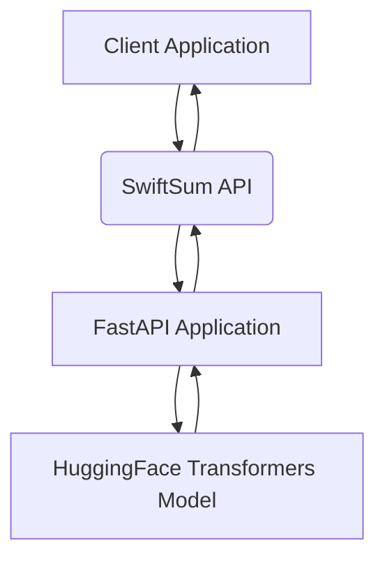

# SwiftSum: 基于 Transformer 的轻量级文本摘要 API

## 简介

SwiftSum 是一个高性能、轻量级的文本摘要 API，它利用预训练的 Transformer 模型，能够将长文本自动提取出简洁、准确的摘要。该项目采用 FastAPI 框架构建，提供快速的 RESTful API 接口，并支持 Docker 容器化部署，方便用户快速集成和使用。SwiftSum 旨在为需要文本摘要功能的应用程序（如新闻聚合、内容分析、智能客服等）提供一个高效、易用的解决方案。

## 核心特性

*   **基于 Transformer 模型**：集成 HuggingFace Transformers 库，支持多种预训练模型（如 `distilbert-base-uncased`）进行文本摘要，确保摘要质量。
*   **高性能 FastAPI 框架**：利用 FastAPI 的异步特性，实现高并发请求处理，提供极速的 API 响应。
*   **RESTful API 设计**：提供清晰、标准的 API 接口，易于与其他系统集成。
*   **Docker 容器化**：提供完整的 `Dockerfile`，支持一键构建和部署，简化环境配置。
*   **API 密钥验证**：内置简单的 API 密钥验证机制，保障 API 访问安全。
*   **速率限制 (Rate Limiting)**：防止滥用，确保服务稳定性。
*   **Swagger UI/ReDoc 自动文档**：FastAPI 自动生成交互式 API 文档，方便开发者查阅和测试。

## 技术栈

*   **后端**：Python 3.9+ (FastAPI, Uvicorn, Transformers, Pydantic)
*   **模型**：HuggingFace Transformers (例如 `distilbert-base-uncased`)
*   **部署**：Docker

## 架构概览



## 快速开始

### 1. 环境准备

确保您的系统已安装 Python 3.9+ 和 Docker。

### 2. 本地运行

1.  **克隆仓库**：
    ```bash
    git clone https://github.com/xuanxuan320321-cloud/SwiftSum.git
    cd SwiftSum
    ```

2.  **安装依赖**：
    ```bash
    pip install -r requirements.txt
    ```

3.  **启动 API 服务**：
    ```bash
    uvicorn main:app --host 0.0.0.0 --port 8000
    ```

    API 服务将在 `http://localhost:8000` 启动。您可以访问 `http://localhost:8000/docs` 查看 Swagger UI 交互式文档。

### 3. Docker 部署

1.  **构建 Docker 镜像**：
    ```bash
    docker build -t swiftsum:latest .
    ```

2.  **运行 Docker 容器**：
    ```bash
    docker run -d --name swiftsum_app -p 8000:8000 -e API_KEY="your_secret_api_key" swiftsum:latest
    ```

    请将 `your_secret_api_key` 替换为您自己的 API 密钥。API 服务将在 `http://localhost:8000` 启动。

## API 文档

访问 `http://localhost:8000/docs` (Swagger UI) 或 `http://localhost:8000/redoc` (ReDoc) 获取完整的 API 接口说明和测试工具。

## 贡献

欢迎提交 Pull Request 或报告 Bug。请确保您的代码符合 PEP 8 规范，并包含相应的测试。

## 许可证

本项目采用 MIT 许可证。详情请参阅 `LICENSE` 文件。
